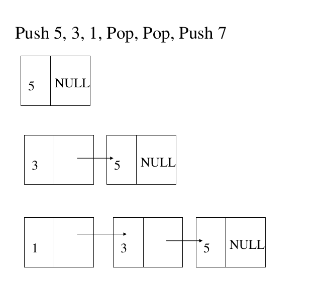
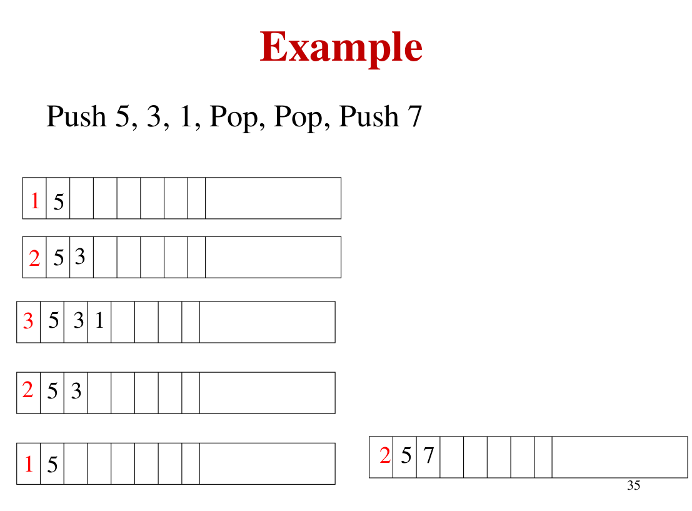

## Abstract Data Types:
* Abstract Data Types (ADTs) are a set of objects together with a set of operations. There's no mention in ADT of how the set of operations is implemented
* Examples include: lists, stacks, sets, graphs...
* C++ allows for the implementation of ADTs with appropriate hiding of implementation details. Any changes in the implementation should not affect the use of the ADT (completely transparent to the rest of the program)
* There is no rule telling us which operations must be supported for each ADT; this is
a design decision. Error handling and tie breaking (where appropriate) are also generally
up to the program designer.

## Usual data types:
* Integers, doubles, booleans... are usual data types, their implementation details are not known and you can perform some operations on them including: addition, substraction, multiplication... without having to know about how these operations are performed
  
## The list ADT:
* We will deal with a general list of the form A0, A1, A2 ... AN-1 (the size of this list is N)
* A list of size 0 is called an **empty list**
* We will assume that the list items are integers to simplify matters, but in general, arbitrarily elements elements are allowed through the use of class templates
* Some popular operations of the list include: printList, find(returns the position of the first occurence of an item), remove, insert, findkth(retruns the element at position k) and makeEmpty....

### Simple array implementation of lists:
* The list can be implemented through the use of arrays, although arrays are created with a fixed capacity and the array size needs to be known beforehand, the vector class which internally stores an array, allows the array to grow as needed 
* Here is the complexity of some common operations on the array:
  * printList => O(N)
  * findkth => O(1)
  * insertion: worst case(insertion at position 0) => O(N), for the last element O(1)
  * deletion worst case(deleting the first item of the list) => O(N), for the last element O(1)
  
### Implementing lists using singly linked lists:
* In order to avoid the linear cost of insertion and deletion, we need to ensure that the list is not stored contiguously.
* The linked list consists of a series of nodes, which are not necessarily adjacent in
memory. Each node contains the element and a link to a node containing its successor. We call this the next link. The last cell’s next link points to nullptr.
* The pointer to the first node is referred to as head and the pointer to the last node is referred to as the tail
* Adding an element at the beginning takes a constant time O(1)
* Adding an element at the end of a linked list (with a tail) takes a constant time O(1)
* Accessing a specific element(finding a certain value) takes a linear time O(N)
* Adding an element at the kth position (input is k) takes a linear time O(N)
* Deleting the first node takes a constant time O(1), deleting an element at the kth position takes O(k), deleting the last element can take either O(N) or O(1)=> depending on whether a tail pointer exists or not
#### Advantages of singly linked lists:
* No need to know the maximum number of elements ahead of time
#### Disadvantages of singly linked lists:
* They use extra memory when compared to the array
* Since the elements in memory are stored randomly, then the elements are accessed sequentially, there is no direct access 

### Doubly linked lists:
* A doubly linked list is a sequence of nodes related to each other, where each node contains pointers to the previous and next elements (one can move in both directions)

#### Advantages of Doubly Linked Lists:
* Reversing the doubly linked list is very easy
* It can allocate or reallocate memory easily during its execution
* The traversal of a doubly linked list is bidirectional (can be done in two ways)
* Deletion of nodes is easy as compared to a singly linked list. The deletion of a node in a singly linked list requires a pointer to the node to be deleted and the previous node, but in the doubly linked list, it only requires a pointer to the node which is to be deleted 
#### Disadvantages of DLLs:
* Use extra memory when compared with arrays and singly linked lists
* There is no direct access, the elements are accessed sequentially
#### Uses of DLLs:
* Used by the browsers to implement the forward and backward navigation of visited web pages
* Used by various applications to implement undo and redo functionalities
* Used by many operating systems in the thread scheduler (the code that chooses what process needs to run at which time), it maintains a doubly linked list of all the processes running at that time.
* Other data structures such as stacks, hash tables, and binary trees can also be constructed or programmed using a doubly linked list

### Circular lists:
* A circular linked list is a sequence of nodes where the last node points to the first node of the list
#### Advantages of circular linked lists:
* We can go to any node and traverse from any node, we just need to stop when we visit the same node again
* As the last node points to the first node, going from the last node to the first node only takes a single step
#### Applications of circular linked lists:
* Used in multiplayer games to swap between players
* On OSs: multiple running applications can be placed in a circular linked list, so that the OS keeps on iterating over these applications giving them time slices (Round Robin Scheduling)
* Music or media player: the use of CLLs allows for a continuous playback of the playlist
## Vector and list in the STL:
* The C++ language includes in its library an implementation of common data structures. This part of the language is popularly known as the Standard Template Library (STL). The list ADT is one of the data structures implemented in the STL. 
* In the STL, there are two popular implementations of the List ADT. 
  * The **vector** provides a growable array implementation of the list ADT. The advantage of using vectors is that it is indexable in constant time. The disadvantage of using vectors is that the insertion and removal of existing items is expensive unless the changes are made at the end of the vector 
  * The **list** provides a doubly linked list implementation of the list ADT. The advantages of using the list is that insertion of new items and removal of existing items is cheap, provided that the position of the changes is known. The disadvantage is that the list is not easily indexable
* Both list and vector are class templates that are instantiated with the type of items that they store, they have some methods in common:
  * int size() const; => returns the number of items in the container (list/vector)
  * void clear(); => removes all elements from the container
  * bool empty() const; => returns true if the container contains no elements, and false otherwise
* Both vector and list(STL) support adding and removing elements from the end of the list in a constant time. Both vector and list support accessing the front item of the list in a constant time. The operations are:
  * void push_back(const Object& x) => adds x to the end of the container (list/vector)
  * void pop_back() => removes the object at the end of the container (list/vector)
  * const Object & back() const => returns the object at the end of the container (list/vector) 
  * const Object & front() const => returns the object at the front of the container (list/vector)
* Because the doubly linked list allows for efficient changes at the front, but the vector does NOT, the following two methods are available only for list:
  * void push_front(const Object& x) => adds x to the front of the list
  * void pop_front() => removes the object at the front of the list
* The vector has its own set of methods that are not part of the list, two methods allow efficient indexing, the other two methdos allow the programmer to view and change the internal capacity:
  * Object & operator[](int idx) => returns the object at index idx in the vector
  * Object & at (int idx) => returns the obejct at index idx in the vector, with range checking
  * int capacity() const => returns the internal capacity of the vector
  * void reserve (int newCapacity) => sets a new capacity to the vector
### Iterators: 
* Some operations on the list especially those to insert and remove from the middle of the list require the notion of a position. In the STL, a position is represented by a nested type, iterator. So, for a list<string>, the position is represented by the type list<string>::iterator, for a vector<int>, the list is represented by the class vector<int>::iterator, and so on. In this tutorial, whenever the keyword iterator is mentioned, it's supposed to refer to the actual nested class name, but for simplicity, we'll use iterator as a shorthand

#### Getting an iterator: 
* The STL lists and all other STL containers define a pair of methods:
  * iterator begin() => returns an appropriate iterator representing the first item in the container
  * iterator end() => returns an appropriate iterator representing the endmarker in the container (the position after the last item in the conatiner). THis method seems a bit unusual because it returns an iterator that is out-of-range
#### Iterator methods:
* Iterators have many overloaded operators such as: !=, ==, copy constructor, =, postincrement, preincrement, postdecrement, predecrement, * (*itr returns a reference to the object stored at iterator's itr's location)
* Example:
  ```C++
  for( vector<int>::iterator itr = v.begin(); itr != v.end(); ++itr )
    cout << *itr << endl;
  ```
  can be replaced by:
  ```C++
  vector<int>::iterator itr = v.begin();
  while( itr !=v.end() )
    cout << *itr++ << endl;
  ```
#### Container operations that require iterators:
Here are some conainer operations that require iterators:
* iterator insert(iterator pos, const Object& x) => add x to the list, prior to the position given by the iterator pos. It's a constant time operation for list, but not for vector, the returned value is an iterator representing the position of the inserted item
* iterator erase(iterator pos) => takes a constant time for lists but not for vector
* iterator erase(iterator start, iterator end) => the second parameter is exclusive
* Note: the entire list can be erased using c.erase(c.begin(), c.end())

### Const_iterators:
* const_iterator is an other nested type, it is a non-const reference to const data, meaning that the data being referenced to by a const_iterator cannot be modified (*itr for const_iterator cannont appear in the left hand side)
* Further, the compiler will force u to use a const_iterator to traverse a const collection, it does so by providing other versions of the begin() and end() functions where each retruns a const_iterator
* The two versions of the begin method can be in the same class 
* If begin() is invoked on a nonconstant container, then the mutator version of the begin function is called, however if the begin() method is invoked on a constant container, then the accessor version of the function begin() which returns a const_iterator is invoked
* NOTE: the two versions of begin() and end() functions are declared and implemented as member functions of list STL class
* Here is an example of an illegal code:
```C++
  list<int> lts = {1, 2, 45};
  list<int>::const_iterator = itr;
  itr = lts.begin();
  *itr = 66; //illegal
```
### Implementation of list(STL):
* First, the STL list is implemented as a doubly linked list, and it maintians pointers to both ends of the list
* In considering the design, we will need to provide four classes:
  * List class itself: contains links to both ends, the size of the list, and a host of methods. The private data members of the list class are: pointer to header node, pointer to tail node, size of the list.
  * Node class: is a private nested class. The Node class contains both data and pointers to the previous and the next nodes (it's implemented using a struct rather than c++ classes, the reason why we choose struct is that the data properties of the struct can default to public as the node itself is private, so only the class can access it!)
  * const_iterator class: to abstract the notion of position, and it's a public nested class. The const_iterator stores a pointer to the current node, and provides implementation of the basic iterator operations, all in the form of overloaded operators: ==, !=, =, ++, --...
  * iterator class which inherits from the const_iterator, it's also a public nested class and it has the same functionality as const_iterator except that operator* returns a reference to the item being viewed rather than a const reference to the item. An important technical issue is that an iterator can be used in any routine which requires a const_iterator, but not vice-versa
* NOTE: we will need to define the big five constructors for our class as well as the Node struct
* The STL list also allows for having a beginning marker as well as an end marker, meaning it contains an extra node at the front of a list to represent the beginning marker and an extra node at the back of the list to represent the end marker. These extra nodes are known as sentinel nodes. The node in the front is known as the header node and the node in the end is sometimes known as a tail node. Therefore, when we create an empty list, we always have the sentinel nodes already created
* Note: An empty doubly linked list of the STL always contains two sentinal nodes. If you instantiate an object of the STL list, the two sentinal nodes will be created  
* The advantage of using sentinel nodes is to to simplify coding by removing hosts to special cases, for instance if we want to remove the first node, we will need to access its previous node, but the head node does NOT have a previous node prior to it. Also, the list's link to the first node during the remove need to be reset again.
* Iterator can be used wherever the const_iterator is needed
For more details about how the STL list is implemented, visit the List.h file in TP/Implementation aid

### Implementation of vectors:
to be continued

## Stacks:
* A stack is a list where you can access, add, or delete elements at one end only!
* The stacks are called 'last in first out' (LIFO) data structures, the last added element amoung the current ones is the one that can be accessed or deleted
* pop and push take constant time O(1)
* You can also test if a stack is empty but nothing else
* A common use of the stack data structure is in function calls, when a subroutine calls another subroutine (including itself) the system must first store its register content (stack frame), so the system pushes the new register contents onto the stack. If there is no more space on the stack, a stack overflow will occur

### Implementing a stack using a singly linked list:
* We will not need to know the maximum size of the list
* We will not need to have a special header node

Important Remark: One should NOT use the stack if add/access/delete operations are needed at some position k different from the beginning of the stack (the top)

### Implementing a stack using an array:
* This method is an alternative implementation, it avoids links and is probably the more popular solution. It
uses the back, push_back, and pop_back implementation from vector, so the implementation is trivial.Associated with each stack is theArray and topOfStack, which is −1 for an empty
stack (this is how an empty stack is initialized). To push some element x onto the stack, we increment topOfStack and then set theArray[topOfStack] = x. To pop, we set the return value to 
theArray[topOfStack] and then decrement topOfStack
* We will need to know the maximum number of elements
* Delete, access, or add an element are all O(1)
* We should store the length of the stack in the 0th position to test if the stack is empty
* Deleting, accessing, or even adding an element to the stack is performed at 
    Stack[Stack[0]+1]

### Uses of the stack:
#### Symbol matching:
* Braces, parentheses, brackets, begin-ends must match each other.
* How to check that this statement [{[()]}] is balanced, however this statement [{]}() is not balanced?
* The solution for this problem can easily be implemented using stacks. How?
* Start from the beginning of the statement
* Push the opening symbols(, {, [ you wish to match and ignore the rest
* Whenever you encounter a closing symbol such as ), }, ] pop the top element from the stack
* If the stack is empty, declare an error
* Otherwise, if the popped element corresponds to the left symbol, then everything goes fine, keep reading
* ELse, report an error
* How much complexity it takes? O(N)
#### Evaluation of arithmetic expressions:
* When using infix notation, and to do the correct operations, the calculator needs to know the priorities of the operators 
* In postfix or reverse polish notation (prefix), we don't need any priority nor parentheses
* The stack is the best Data Structure used to efficiently evaluate an expression written in postfix notation 
* Example
<table>
<tr>
<th>Infix notation</th>
<th>Postfix Notation</th>
<th>Prefix Notation</th>
</tr>
<tr>
<td>5*4+6+7*2</td>
<td>54*6+72*+</td>
<td>+*54+6*72</td>
</tr>
</table>

* Using the stack, start by pushing operands one after the other
* Once an operation is encountered, pop the first two operands, operate them, then push the result again to the stack as a new operand, and repeate

## Queues:
* A queue is a linked list where an element is inserted at the back(end) and removed from the front(beginning), this service is called First IN First Out(FIFO)
* Insert in the queue is referred to as enqueue
* Remove from the queue is referred to as dequeue
### Implementing a queue using a linked list:
* Insertion is done at the back of the linked list
* You should maintain a pointer to the last item of the queue and update it whenever a new element is enqueued
* You should also maintain a pointer to the first item of the queue (front pointer) and update it whenever an item is dequeued
* Both operations on the queue take constant time O(1)
<br>
<br>


### Array implementation of a queue:
* Using arrays, insertion at the back has complexity O(1), but deletion from the front has complexity O(N). Can this be improved?
* Absolutely yes, it's done through the use of a circular array
* You should maintain the length of the queue as a separate variable independent from the queue itself
* You should also maintain two positions for both the front and the back of the queue
* Start inserting at the back of the array, When an element is deleted from the beginning (Front), do NOT move all elements forward, just mark the position as blank
* Any problem?
* You will soon reach the end of the array even though there are spaces in the beginning to insert in, in this situation, you should roll back to the beginning, meaning that if you reach the end of the array without reaching the maximum capacity of the array, just insert the new item at the front of the array
* Using circular arrays to implement queues makes both the enqueue and dequeue operations take constant time O(1)
* Example: suppose after processing, you have reached the following situation: