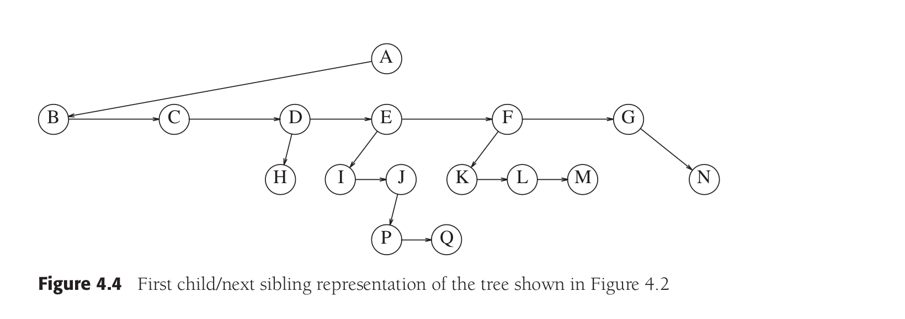
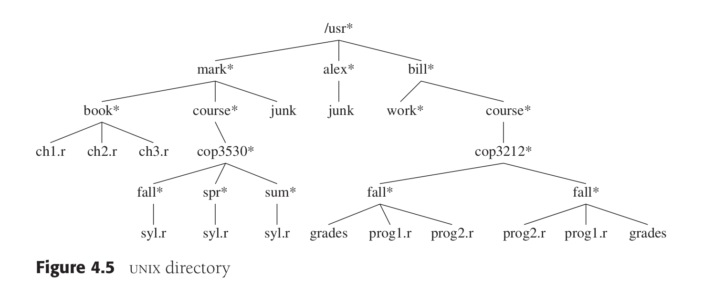

# Trees:
## From linear ADTs to non-linear ADTs:
* For input of large size, the linear access time of linked lists is very costly
* In this chapter we will use trees to optimize the average running time of most operations (as most operations take O(log n)) and we will make some simple modification to get O(log n) in the worst case

## Chapter's outline:
We will see how trees are used to:
* Implement the file system of several popular OSs
* Evaluate arithmetic expressions
* Support search operations in O(log n) average time
* Refine these ideas to obtain O(log n) worst case bounds
* Implement these ideas when the data are stored on a disk

## Formal definitions:
* What's a tree?
  A tree is a non-linear sequence of nodes. The starting node is known as **root node**
* The tree consists of a distinguished node, r, called the root, and zero or more nonempty (sub)trees T1 , T2 , . . . , Tk each of whose roots is connected to r by a directional edge.
* The root node does NOT have a parent node. But, every node other than the root has a parent node
* The nodes may have any number of children, themselves being roots of the subtrees
* A tree of N nodes has one root and N-1 edges. The fact that there are N-1 edges follows from the fact that each child node is connected to its parent by one edge and each node has a parent node, except the root, then the total number of edges is N-1
* Each node might have an arbitrary number of children, possibly zero (no children)
* Nodes with no children are known as leaves
* Nodes with the same parent node are known as siblings
* Grandparent and grandchild relations are defined in the same manner
* A path from n1 to nk is defined as a sequence of nodes n1, n2, ..., nk such that ni is the parent of ni+1 for each 
1 <= i < k. The length of the path is the number of edges in that path namely K-1
* There is a path of length 0 from one node to itself
* In a tree, there is only one unique path from the root to each node
* What is the depth of a node?
  For any node ni, the depth of ni is the length of the unique path from the root to ni. Thus, the root has depth 0
* What is the height of a node ni?
  The height of a node ni is the length of the longest path from the node ni to a leaf. Thus all the leaves are of height 0
* The height of the tree is the height of the root, that said, is the length of the longest path from the root to a leaf
* The depth of the tree is equal to the depth of the **deepest leaf**, this is always equal to the height of the tree
* If there is a path from n1 to n2, then n1 is an ancestor of n2 and n2 is a descendant from n1, if n1!=n2, then n1 is a proper ancestor and n2 is a proper descendant

## Implementation of trees:
* One way to implement a tree would be to have at each node besides data a link to each child of the node. However since the number of children per node can vary so greatly and is not known beforehand, this solution might NOT be feasible.
* The solution is simple **Keep the children of each node in a linked list of tree nodes** you can implement the node to have besides data two links: the first link is to the first child of the node, and the second link is to the next sibling of the node

## Tree Traversals with an Application:
* There are many applications for trees. One of the popular uses is the directory structure (file system) in many common operating systems including UNIX and DOS

<caption>
The * next to /usr indicates that /usr is a directory
</caption>

* The filename /usr/mark/book/ch1.r is obtained by following the leftmost child three times. Each / after the
first indicates an edge; the result is the full **pathname**.
* This hierarchical file system is very popular because it allows the users to organize data logically. Furthermore, two files in different directories can share the same name because they must have different paths from the root and thus have different pathnames
* A directory in the UNIX file system is just a file with a list of all its children(a directory in UNIX file system is just a file)
## Methods of traversing a tree:
* preorder: the root node is traversed before the child nodes that will be traversed from left to right
* postorder: the root node will be traversed after the child nodes are traversed from left to right
* inorder: the left child nodes are traversed first, followed by the root node, followed by the right child nodes of the root
* Complexity analysis: the time complexity for the different ways of traversal is linear O(N)

### Applications of preorder traversal and postorder traversal:
* PREORDER traversal is used for displaying the hierarchy of a UNIX file system, where each directory name is displayed first, then the subdirectories (subfiles) are displayed from left to right
* POSTORDER traversal is used for calculating the total size of the root directory, where the size of each root directory is the sum of the size of its subdirectories. Then, the size of the subdirectories of each root directory are displayed from left to right, followed by the size of the root directory which eventually will be the sum of the sizes of the subdirectories as well as the size of the root directory
  
## Binary trees:
* A binary tree is a tree where each node has at most two children 