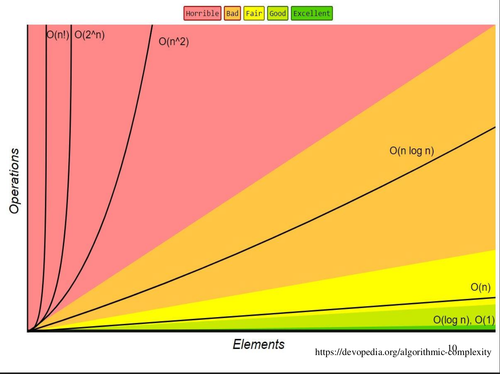

# Chapter TWO: Algorithm Analysis
### Chapter's outlines:
* Algorithm efficiency
* Algorithm analysis (machine-dependent or machine-independent)
* Function ordering (weak order, Big-Oh(assymptotically <=), Big-Omega(assymptotically >=), Big-Theta(assymptotically =), Little-Oh(assymptotically <))
* Algorithm complexity analysis (rules for complexity analysis, analysis of various types of algorithms)
* Master theorem
  
### Design Challenges:
* Designing an algorithmic solution is not sufficient, the solution should:
  * Not take ages
  * Not consume too much memory
### Designing challenges: 
Remember the n view points of a city and the nightmare of obtaining an exponent complexity

### What is the efficiency of an algorithm?
To multiply two positive integers **a** and **b**, there are two different approaches:
  **First approach:** multiply a by b using the regular * operator
  **Second approach:** the following algorithm may implement the solution:

  ```text
  v = a, w = b
  While w > 1
    { v = v + a;
    w = w - 1}
    Output v
  ```
#### Machine-dependent Analysis:
* For some machines, using the regular * operator to perform the multiplication operation may be more costly, ideally:
* Programme all the alternative algorithms
* Run them on the target machine
* Find which is more/most efficient

#### Machine-independent Analysis:
* We will assume that every basic operation takes a constant time
  * Basic operations include: +, -, *, /, memory access. There is no difference between the basic operations
  * Non-basic operations include: searching and sorting
* Thus, the efficiency of an algorithm is measured in terms of the number of basic operations it performs
* For the previous example, the first subroutine uses 1 basic operation, however the second subroutine used 2b basic operations, so we consider the subroutine 1 to be more efficient
* In fact, we will not worry about the exact number of operations, but we will look at "broad classes" of values. For example, if an algorithm needs n basic operations and an other needs 2n basic operations, then they are considered to be in the same efficiency category
* We will distinguish between exp(n), n, log(n), nlog(n), n², 2^n, n!...


#### Weak ordering:
##### Remark!
* For this chapter, f and g are functions from the set of natural numbers N to itself, they will describe the time or memory required to solve a problem of size n
* Restrictions are put on these functions:
  * They are defined for n>=0
  * They are increasing (monotonic increase)
  * They are strictly positive for all n in N
  * In fact, f(n)>c for some value c>0, that is any problem requires at least one instruction and Byte.

<br>

* Consider these two definitions:
   
  * We will consider two functions f and g to be equivalent f~g, if:
  lim f(n)/g(n) = c
  when n tends to infinity
  Where 0<c<infinity
  * f < g if lim f(n)/g(n) = 0 when n tends to infinity 
* For the functions we're interested in, these definitions define a weak ordering 
<br>

* Let f(n) and g(n) describe the run-time of two algorithms, then:  
  * If f(n) ~ g(n), then it is always possible to improve the performance of one function over the other one by purchasing a faster computer
  * If f(n) < g(n), then you can never make the function f run in less time than the function g
  
### Function Orders: Big Oh Notation:
**Definition:**
f(n)=O(g(n)) if there are positive constants c and n0, such that:
  For all n>=n0
0 <= f(n) <= c*g(n) 
* Meaning: A function f(n) is O(g(n)) if the rate of growth of f is not faster than that of g
* If lim f(n)/g(n) when n tends to infinity, exists and is finite, then f(n) is O(g(n))
* Intuitively(not exactly), f(n) is O(g(n)) means f(n)<= g(n) for all n beyond some value n0. i.e. g(n) is an upper bound for f(n)

#### Examples:
<table>
<tr>
<th>The limit</th>
<th>The conclusion</th>
<tr>

<tr>
<td>lim (n/sqrt(n)) when n tends to infinity = infinity</td>
<td>n is not O(sqrt(n))</td>
<tr>

<tr>
<td>lim (sqrt(n)/n) when n tends to infinity = 0</td>
<td>sqrt(n) is O(n)</td>
<tr>

<tr>
<td>lim (2n/n) when n tends to infinity = 2</td>
<td>2n is O(n)</td>
<tr>

<tr>
<td>lim (n/2n) when n tends to infinity = 1/2</td>
<td>n is O(2n)</td>
<tr>

<tr>
<td>lim (ln(n)/n) when n tends to infinity = 0</td>
<td>ln(n) is O(n)</td>
<tr>

<tr>
<td>lim (n/ln(n)) when n tends to infinity = infinity</td>
<td>n is not O(ln(n))</td>
<tr>

<tr>
<td>lim (exp(n)/n) when n tends to infinity = infinity</td>
<td>exp(n) is NOT O(n)</td>
<tr>

<tr>
<td>lim (n/exp(n)) when n tends to infinity = 0</td>
<td>n is O(exp(n))</td>
<tr>

<tr>
<td>lim ([n+sqrt(n)]/n) when n tends to infinity = 1</td>
<td>n+sqrt(n) is O(n)</td>
<tr>

<tr>
<td>lim (n/[n+sqrt(n)]) when n tends to infinity = 1</td>
<td>n is O(n+sqrt(n))</td>
<tr>

<tr>
<td>lim (n+n²/n) when n tends to infinity = infiniy</td>
<td>n+n² is NOT O(2n)</td>
<tr>

<tr>
<td>lim (n/n+n²) when n tends to infinity = 0</td>
<td>n is NOT O(n²+n)</td>
<tr>
</table>

#### Interpretations of Big Oh notation:
* Suppose that we know that our algorithm uses at most O(f(n)) basic steps for any n inputs, and n is sufficiently large. Therefore, we know that our algorithm will terminate after executing at most f(n) basic steps, for all large n.
* We also know that a basic step takes a constant time on a machine
  
### Other complexity: Big Omega notation:
**Definition:**
f(n) = &Omega; (g(n)) if there exist two positive constants c and n0 such that: 
  For all n >= n0:
f(n) >= c*g(n)
* If lim(f(n)/g(n)) when n tends to &infin; exsits, then
 
 lim(f(n)/g(n)) when n tends to &infin; > 0 
* In this case, we say that g(n) is a lower bound of f(n). i.e. no matter what specific inputs we have, the algorithm will not run faster than its lower bound

#### Interpretations of the &Omega; Notation:
* Suppose an algorithm has complexity of &Omega; (f(n)), this means that there exists a positive constant **c** such that for all sufficiently large n there exists at least one input for which the algorithm consumes at least c*f(n) steps
  
#### Difference between &Omega; and O Notation:
Here is an example:
* &Omega;(n) means the algorithm runs at least in n times but could actually take a loooot larger!
* O(n) means the algorithm runs in its worst case in n (linear) time
  
### Other complexity: Big &Theta; Notation:
**Definition:**
f(n) = &Theta;(g(n)) if and only if f(n) = O(g(n)) and f(n)= &Omega;(g(n))
* &Theta;(g(n)) is referred to as assymptotic equality
* If lim(f(n)/g(n)) when n tends to &infin; exists, then lim(f(n)/g(n)) when n tends to &infin; is a finite, strictly positive constant
* f(n) has a rate of growth equal to that of g(n) 

### Other complexity: Little-Oh Notation:
**Definition:**
f(n)=o(g(n)) if, for all positive constance c, there exists an n0 such that for all n>n0:
  f(n)< c*g(n)
* Little-Oh Notation is also referred to as (assymptotic strict inequality)
* Less formally, f(n)=o(g(n)) if f(n)=O(g(n)) and f(n) &ne; &Theta;(g(n))
* suppose f(n) = o(g(n)). Then, if lim (f(n)/g(n)) when n tends to &infin; = 0 exists, then lim(f(n)/g(n)) when n tends to &infin; = 0 
* Little-oh means: ultimately smaller than 
### Rates of growth:


### Conclusion:
* O => finite
* &Omega; => strictly positive
* &Theta; => finite+ strictly positive
* o => 0
### Example Functions:
#### Examples:
<table>
<tr>
<th>The limit</th>
<th>The conclusion</th>
<tr>

<tr>
<td>lim (n/sqrt(n)) when n tends to infinity = infinity</td>
<td>n is &Omega;(sqrt(n))</td>
<tr>

<tr>
<td>lim (n/ln(n)) when n tends to infinity = infinity</td>
<td>n is &Omega;(sqrt(n))</td>
<tr>

<tr>
<td>lim (n/2n) when n tends to infinity = 1/2</td>
<td>n is &Theta;(sqrt(n))</td>
<tr>

</table>

### Classes:
* The most common classes are given names:
* &Theta;(1) => constant
* &Theta;(ln(n)) => logarithmic
* &Theta;(n) => linear
* &Theta;(nln(n)) => n log n
* &Theta;(n²) => quadratic
* &Theta;(n^3) => cubic
* 2^n, e^n, 4^n => exponential

### Little-o as a weak ordering:
* We can show that, for example ln(n)=o(n^p) for any p>0 using l'Hopital's rule
  
### Algorithms Analysis:

* An algorithm is said to have **polynomial time complexity** if its run-time may be described by O(n^d) for some fixed d>=0. We will consider such algorithms to be efficient
* Problems that have no known polynomial-time algorithms are said to be **intractable**
* For example, traveling salesman problem: find the shortest path that visits n cities. The best run time for that is &Theta;(n²2^n) => it's not quadratic but exponential
* In general, you don't want to implement exponential-time or exponential-memory algorithms
  
### Rules for arithmetic with big-O symbols:
1. If T1(n) = O(f(n)) and T2(n) = O(g(n)), then:
  * T1(n)+T2(n) = O(f(n)+g(n)), intuitively and less formally it is O(max(f(n), g(n)))
  * T1(n)*T2(n) = O(f(n) * g(n))
2. If T(n) is a polynomial of degree k, then T(n)=&Theta; (n^k)
3. (log(n))^k = O(n) for any constant k => this tells us that logarithms grow very slowly
4. If f(n) = O(g(n)), then c * f(n) = O(g(n)) for any constant c
5. If f1(n)=o(g(n)) but f2(n)=O(g(n)), then f1(n)+f2(n)=O(g(n))
6. If f(n)=O(g(n)), and g(n)=o(h(n)), then f(n)=o(h(n)) => complexity of g o h
## Complexity of a problem VS complexity of an algorithm:
* A problem is O(f(n)) means there is some O(f(n)) algorithm to solve the problem
* A problem is &Omega;(f(n)) means every algorithm that can solve the problem is &Omega;(f(n))

## Algorithm complexity analysis:
* We define Tavg(N) and Tworst(N), as the average and worst-case running time respectively used by an algorithm on input of size N. Clearly, Tavg(N) <= Tworst(N)
* Occasionally, the best-case performance of an algorithm is analyzed, but it is of a little interest, as it does not represent the typical behavior
* Average-case performance often reflects typical behavior 
* Worst-case performance represents a guarantee for performance on any possible input 
* Consider the following algorithm:
  diff = sum = 0;
  For (k=0: k < N; k++)
    sum -> sum + 1;
    diff -> diff - 1;
  For (k=0: k < 3N; k++)
    sum -> sum - 1;
* First line takes 2 basic steps
* Every iteratioins of the first loop takes 2 basic steps, the number of iterations of the first loop is N
* Every iteration in the second loop takes 1 basic operation, the number of iterations of the second loop is 3N
* Overall, 2 + 2 * N + 3 * N  steps, that is O(N)

## Rules for Complexity Analysis:
### Complexity of a loop:
O (Number of iterations in a loop * maximum complexity of each iteration)
* Nested loops:
  * First, Analyze the innermost loop 
  * Then, you can find the complexity of next outer loop using the formula:
<aside>
Complexity of the outer loop = complexity of the inner loop * number of iterations of the outer loop ...
</aside>

#### Complexity of conditional statements 
* The complexity of if/else statement is calculated as follows:
maximum of the complexity of the blocks. For exmaple, 
if(condition)
  S1
else
  S2
{Maximum of two complexities}
* In the previous example, the complexity is max(O(S1), O(S2)), the conditions are usually counted too
### Analysis of recursion:
* Double  recursion is a recursion that calls itself twice(not necessarily with the same arguments) at each function's call 
* No matter how much basic operations we have, it is always constant O(1)
* Suppose we have the code (not a good one):
```C++
Long fib (int n) {
if (n == 0 || n == 1)
1
return 1;
2
else
return fib(n – 1) + fib(n – 2);
3
}
```
* We have:
  * T(0) = T(1) = 1;
  * n>=2 T(n) = cost of constant op at 1 + cost of line 3 work
* Then, T(n) = 1 op + (addition + 2 function calls) = O(1) + (addition +
cost of fib(n-1) + cost fib(n-2))
* Then T(n)=T(n-1)+T(n-2)+2
* We can easily show by induction that T(n)>=fib(n)
* We can also prove that fib(n)>=(3/2)^n for any n>4
* Therefore the running time for the previous algorithm is:
T(n) = O(1.5^n). Thus, the algorithm grows exponentially
## The maximum subsequence Sum: 
consider the directory lecture practices for full explanation

## Binary Search:
consider checking the file on the path ./Lectures Practices/binarySearch.cpp
## The Master Theorem:
* The Master Theorem is used to calculate time complexity of divide-and-conquer algorithms, it provides a simple and quick way to calculate the time complexity of a recursive relation of the form:
  T(n) = aT(n/b) + f(n)
Where:
  * n is the size of the input
  * a is the number of subproblems in the recursion
  * n/b is the size of each subproblem (assumed that all subproblems have the same size, which is n/b)
  * f(n) is the cost of work done outside recursive calls, including the cost of dividing the problem and solutions merge cost
### Master Theorem:
Let a>=1 and b>1 be constants, let f(n) be a function, and let T(n) be defined on the nonnegative integers by the recurrence:
  T(n) = a*T(n/b) + f(n)
Where n/b is either the floor or the ceil of n/b. Then, T(n) has the following asymptotic bounds:
  1. If f(n)=O(n^(logb(a)-&epsilon;)) for some &epsilon; >0, then T(n)=&theta;(n^(logb(a)))
  2. If f(n)=&theta;(n^(logb(a))), then T(n)=&theta;(n^(logb(a))* log(n))
  3. If f(n)=&omega;(n^(logb(a)+&epsilon;))
for some constant &epsilon;>0, and if a*f(n/b)<= c*f(n) for some constant c<1, then T(n)=&theta;(f(n))


* Designing good algorithms depend on:  
  * The time taken 
  * The memory usage
* Travelling salesman algorithm
* Subroutine is an old word referring to a function
* we'll assume that the time taken for every basic operation is constatn
* basic operations are arithmetic operators...
* we consider the basic operations as equal operations
* we'll look at the functions that govern the complexity of an algorithm, like exp, ln, n(linear)
* O(1) is a constant time 
* factorial is the worst case scenario
* we'll consider f and g as functions from N to N
* weak ordering refers to if we can find a difference (or ordering between thm in the limit)
* if f ~ g then improving the hardware gives a better behaviour
* if f < g it cannot be improved
* Big O and the others are trends to relate two complexities between each others
* To characterize big o, calculate the limit between f(n) and g(n) you will find it 0
* To characterize big omega, the limit should be greater than 0
* big oh is asymptotic less than or equal
* little oh is asymptotic strict less than